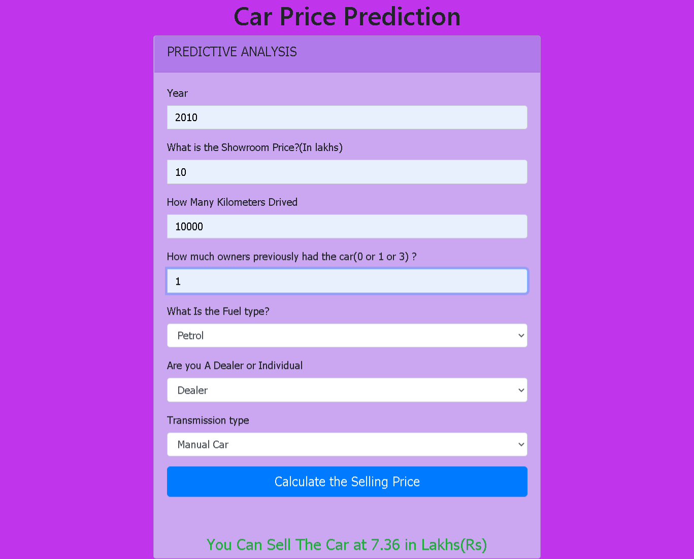
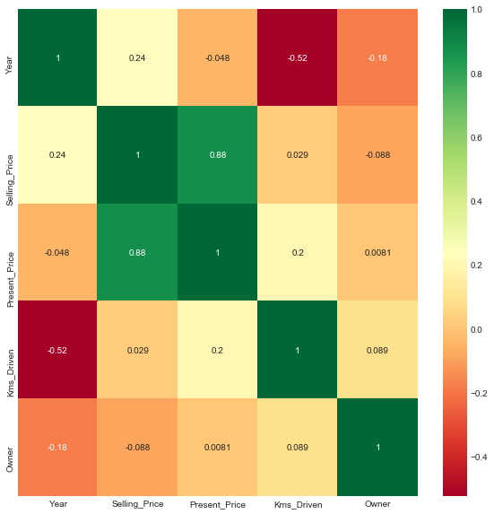
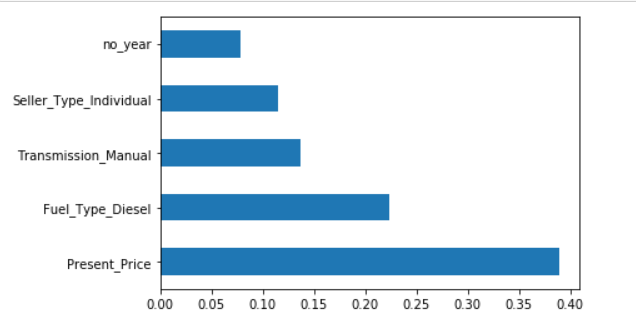

# Used Car Price Estimator: 
  
## Table of Content
  * [Demo](# demo)
  * [Overview](#Project Overview)
  * [Resources Used](#Resources Used)
  * [Local Installation](#Local Installation)
  * [Data Cleaning](#Data Cleaning)
  * [Exploratory Data Analysis](#Exploratory Data Analysis)
  * [Model Building](#Model Building)
  * [Model performance](#Model performance)
  * [Deployement on Heroku](#Heroku WebApp Deployment)
  * [Further Changes to be Done](#Further Changes to be Done)
  
## Demo


https://car-price-prediction01.herokuapp.com/

## Project Overview 
* Created a tool that estimates Used Car Price (RSME~ 1.97) to help Car buyers to negotiate their price with the vendor.
* DataSet is downloaded from [Kaggle](https://www.kaggle.com/nehalbirla/vehicle-dataset-from-cardekho)
* DataPreprocessing is done to  clean and extract useful features to built a good model with better accuracy.
* Tested with Linear Regressor, Decission Tree Regressor and  Random Forest Regressors.
* Based on simple cross_val_score, Random Forest Regressors is selected and further optimized  using RandomizedCV to reach the best model.
* Built a client facing API using flask 

## Resources Used 
**Python Version:** 3.7  
**Packages:** pandas, numpy, sklearn, matplotlib, seaborn, flask,pickle.

## Local Installation
1. Clone the Repo by going to your local Git Client and pushing in the command: 
```sh
https://github.com/diwakarDrs/Car_Price_Prediction.git
```
2. Install the Packages: 
```sh
pip install -r requirements.txt
```
3. At last, push in the command:
```sh
python app.py
```
4. Go to ` http://127.0.0.1:5000/` and to view the application.

**Flask Productionization:** https://towardsdatascience.com/productionize-a-machine-learning-model-with-flask-and-heroku-8201260503d2

## Data Cleaning
After downlaoding the data, I needed to clean it up so that it was usable for our model. I made the following changes and created the following variables:

*	To get overview of datasets, i had used pandas commands like shape,describe, unique.
*	Checked for any missing values.
*	Created a dataframe with slected columns needed for analysis.
*	'Current year'column is created.
*	Made columns for 'number_ of_years' from difference of 'year'and 'current year' column
*	Removed  unncessary columns.

## Exploratory Data Analysis
I looked at the distributions and realationship of the data .Below are a few highlights from the pivot tables. 
### Correlations

### Features Importance


## Model Building 
First, I transformed the categorical variables into dummy variables. I also split the data into train and tests sets with a test size of 20%.   

I tried three different models and evaluated them using Mean Absolute Error. I chose MAE because it is relatively easy to interpret and outliers aren’t particularly bad in for this type of model.   

I tried three different models:
*	**Multiple Linear Regression** 
*	**DecisionTreeRegression** 
*	**Random Forest** 

## Model performance
The Random Forest model better than other approaches on the test and validation sets. 
*	**Random Forest** : Cross_validation_Score= 0.39
*	**Decision Tree**:Cross_validation_Score = 0.3
*	**Linear Regression**:Cross_validation_Score = -18.17

Again optimize the Random Forest model with RandomizedCV  to check for least error :
  **Random Forest** : RMSE= 1.97
  
  
## Productionization 
In this step, I built a flask API endpoint that was hosted on a local webserver by following along with the TDS tutorial in the reference section above. The API endpoint takes in a request with a list of values for Used Cars and returns an estimated Price. 


### Heroku WebApp Deployment

https://car-price-prediction01.herokuapp.com/

##  Further Changes to be Done

- [ ] Deploying the Web Application on AWS/IBM/GCP/Azue Cloud.
- [ ] Development using ANN.
- [ ] Enhance the User-Interface using HTML/CSS.
- [ ] Set the Application on Docker.


